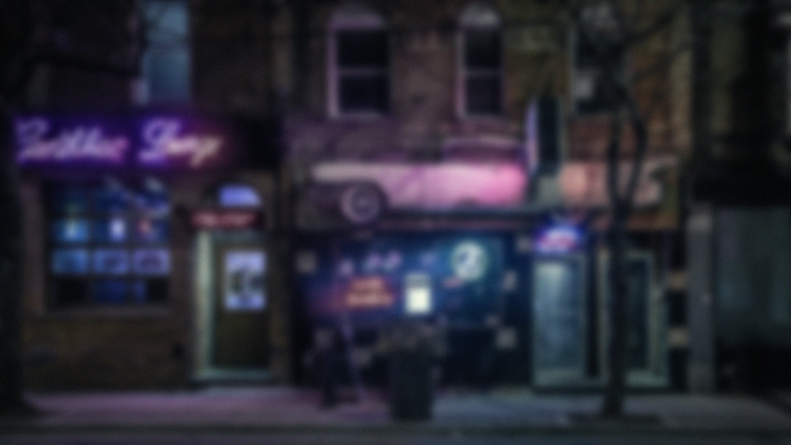

# Glassy

A simple CLI tool to apply glass-like overlay effect to images.
It adds variable blur and noise to image as overlay to give them a glassy look.

## Usage

```sh
~ $ glassy -h

A simple CLI tool to apply glass-like overlay effect to images

Usage: glassy.exe [OPTIONS] <PATH>

Arguments:
  <PATH>  Path to image file

Options:
  -e, --effect-strength <EFFECT_STRENGTH>
          Strength of the glass effect [default: medium] [possible values: low, medium, high]
      --no-grain
          Apply effect without grain
  -o, --output <PATH>
          Specify output file path
  -v, --verbose
          Explain what is being done
  -h, --help
          Print help
  -V, --version
          Print version
```

## Sample Images

 | 
--- | ---
**Original Image** | **Low Effect Strength**
 | 
**Medium Effect Strength** | **High Effect Strength**
